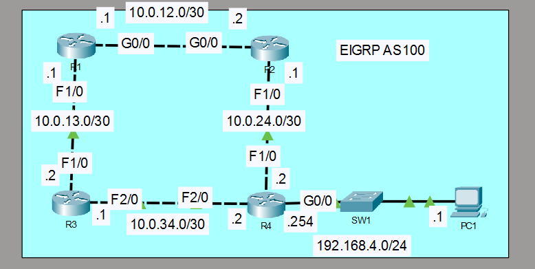

# EIGRP Unequal-Cost Load Balancing

## Objective

Configure EIGRP AS 100 across a four-router topology and enable unequal-cost load balancing on R1 toward the 192.168.4.0/24 LAN. Verify neighbor relationships, route installation, and end-to-end connectivity.

## Topology

## Concepts

- EIGRP AS 100
- IPv4 dynamic routing
- /30 point-to-point networks
- /32 loopback interfaces
- Passive interfaces
- Disabled automatic summarization
- Unequal-cost load balancing with `variance 2`

## Configuration Highlights

- R1 was configured with `variance 2` to install two unequal-cost EIGRP paths toward 192.168.4.0/24.
- Loopback networks were advertised in EIGRP while the loopback interfaces were kept passive.
- R4 advertised the 192.168.4.0/24 LAN while its LAN-facing interface remained passive.
- EIGRP automatic summarization was disabled on all routers.

## Verification

The lab was verified using EIGRP neighbor checks, protocol verification, routing-table inspection, and end-to-end ICMP testing.

- R1 installed 192.168.4.0/24 through 10.0.12.2 with metric 28672.
- R1 also installed 192.168.4.0/24 through 10.0.13.2 with metric 30976.
- PC1 successfully reached R1 Loopback0 at 1.1.1.1 with 0% packet loss.

Key verification commands included `show ip eigrp neighbors`, `show ip protocols`, and `show ip route 192.168.4.0`.

## Result

EIGRP converged successfully across the topology, and R1 installed two unequal-cost routes toward the destination LAN. End-to-end connectivity remained operational after final configuration cleanup.
