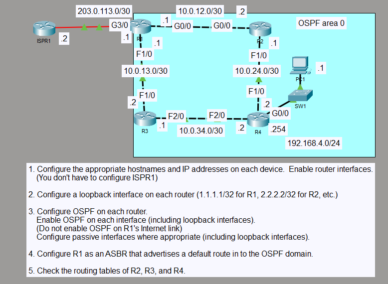

# OSPF Default Route Advertisement

## Objective

I configured OSPF Area 0 on four routers and used R1 to share a default route toward the ISP.

## Topology

## Concepts

- OSPF Area 0
- Default route advertisement
- External Type 2 routes
- Equal-cost paths

## Configuration Highlights

- I used OSPF process 1 on R1, R2, R3, and R4.
- I advertised the loopbacks and R4's LAN while keeping those interfaces passive.
- On R1, I added a static default route toward the ISP and shared it through OSPF with `default-information originate`.

## Verification

I checked OSPF neighbors, protocol settings, and routing tables. The router neighbors reached FULL state, and PC1 could ping the remote loopbacks.

## Result

R2 and R3 learned the default route from R1 as an OSPF E2 route. R4 installed two equal-cost default paths, one through R2 and one through R3.
