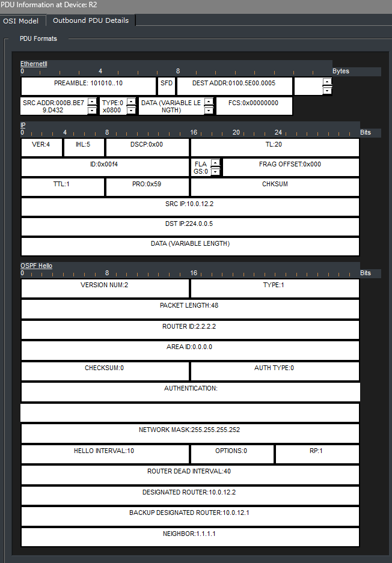

# OSPF Reference Bandwidth and Path Selection

## Objective

I used this lab to check how OSPF costs affect route selection. I also shared R1's default route with the other routers in Area 0.

## Topology

## Concepts

- OSPF reference bandwidth and interface costs
- Default route advertisement
- OSPF Hello packets

## Configuration Highlights

- I enabled OSPF process 1 directly on the router interfaces.
- I set the reference bandwidth to 10000 Mbps. GigabitEthernet links had a cost of 10, and FastEthernet links had a cost of 100.
- R1 used `default-information originate` to share its static default route toward the ISP.

## Verification

I checked OSPF neighbors, interface costs, and routing tables. The neighbors reached FULL state, and the ping tests passed.

I also checked the default-route LSA and inspected an OSPF Hello packet in Packet Tracer Simulation Mode.

## Result

R4 selected R2 (10.0.24.1) for its OSPF E2 default route because the OSPF cost to R1 was lower through R2 than through R3.
