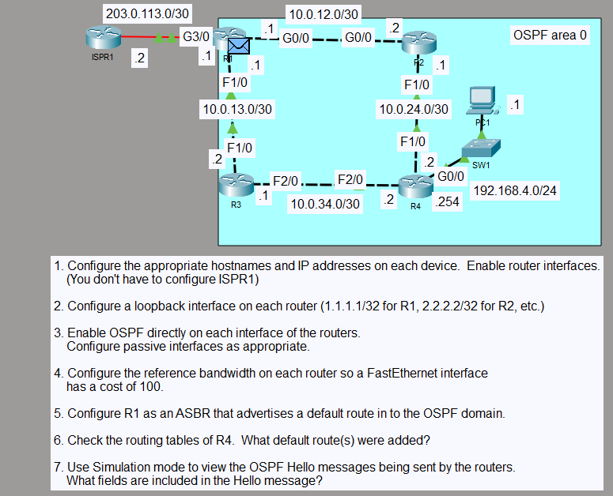

# OSPF Reference Bandwidth and Path Selection

## Objective

Configure a single-area OSPF topology in Area 0 and examine how OSPF interface costs influence route selection. The lab also uses R1 as an ASBR to advertise a static default route into the OSPF domain.

## Topology

## Concepts

- OSPF Area 0
- Loopback interfaces
- Passive interfaces
- OSPF reference bandwidth
- Interface cost calculation
- Cost-based path selection
- ASBR operation
- Default route advertisement
- OSPF external Type 2 routes
- OSPF Hello packet fields

## Configuration Highlights

- OSPF process 1 was enabled directly on participating interfaces.
- The OSPF reference bandwidth was set to 10000 Mbps, producing a cost of 10 on GigabitEthernet links and 100 on FastEthernet links.
- Loopback interfaces and non-neighbor-facing interfaces were configured as passive where appropriate.
- R1 used a static default route toward the ISP and advertised it with `default-information originate`.
- Because the internal OSPF cost to R1 was lower through R2 than through R3, R4 selected R2 as the next hop for the external default route.

## Verification

The lab was verified using:

- `show ip ospf neighbor`
- `show ip ospf interface brief`
- `show ip route`
- `show ip protocols`
- `show ip ospf database external`
- End-to-end ICMP connectivity
- Packet Tracer Simulation Mode inspection of OSPF Hello packet fields

## Result

All required OSPF adjacencies reached FULL state. R1 advertised the default route as a Type-5 external LSA, and R4 installed the `O*E2` default route through R2 (`10.0.24.1`) because that path had the lower internal OSPF cost to the ASBR.
