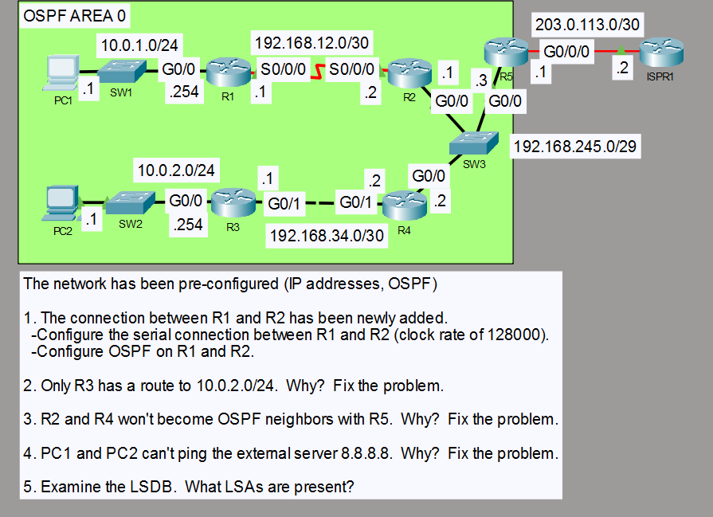

# OSPF Troubleshooting and LSDB Analysis

## Objective

Troubleshoot a pre-configured single-area OSPF network in Area 0 and restore full routing connectivity across the topology. Verify OSPF neighbor relationships, route propagation, external connectivity, and the resulting link-state database.

## Topology

## Concepts

- OSPF Area 0
- IPv4 routing
- /30 point-to-point networks
- OSPF neighbor adjacency
- OSPF network types
- Passive interfaces
- Default route advertisement
- OSPF external Type 2 routes
- OSPF link-state database
- Type 1, Type 2, and Type 5 LSAs

## Configuration Highlights

- The new R1-R2 serial link was addressed and added to OSPF Area 0, with R1 providing the required DCE clock rate.
- The OSPF network-type mismatch on the R3-R4 segment was corrected so the 10.0.2.0/24 LAN could be propagated correctly.
- OSPF adjacencies were restored across the shared 192.168.245.0/29 segment.
- R3 advertised its LAN while keeping the LAN-facing interface passive.
- R5 used a static default route toward the ISP and originated it into OSPF with `default-information originate`.

## Verification

The lab was verified using:

- OSPF neighbor-state verification
- OSPF interface and protocol inspection
- IPv4 routing-table verification
- OSPF LSDB inspection
- End-to-end ICMP connectivity to 8.8.8.8
- Traceroute verification from both LANs

The final LSDB contained Type 1 Router LSAs, Type 2 Network LSAs, and a Type 5 AS External LSA for the advertised default route.

## Result

All required OSPF adjacencies reached FULL state, both LANs learned the expected routes, and the default route was distributed through the OSPF domain as an external Type 2 route. PC1 and PC2 successfully reached the external 8.8.8.8 destination.
