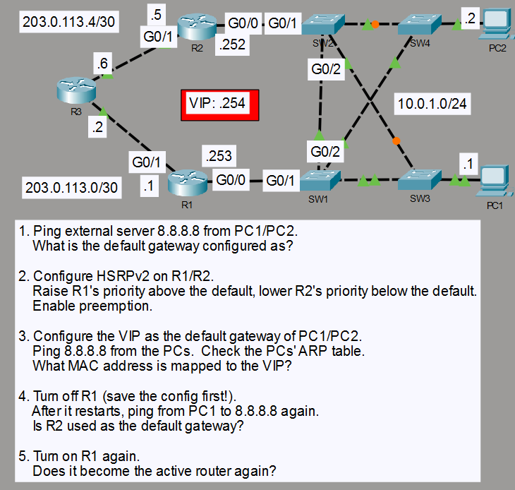

# HSRPv2 Gateway Redundancy

## Objective

I configured HSRPv2 on R1 and R2 so the PCs could keep the same default gateway if R1 went offline.

## Topology

R3 was already configured in the lab, so I left it unchanged.

## Concepts

- HSRPv2 active and standby roles
- Virtual IP and MAC addresses
- Priority and preemption
- Gateway failover

## Configuration Highlights

- I used HSRP group 1 with the virtual IP 10.0.1.254.
- I set R1's priority to 150 and R2's to 50.
- I enabled preemption on both routers and set both PCs' default gateway to 10.0.1.254.

## Verification

I checked the HSRP roles with `show standby` and confirmed that both PCs mapped the virtual IP to MAC address 0000.0c9f.f001.

I checked connectivity to 8.8.8.8, powered off R1 to test failover, and turned it back on to test preemption.

## Result

R2 took over when R1 was powered off. After R1 came back online, it became active again. The PCs kept the same default gateway throughout the test.
