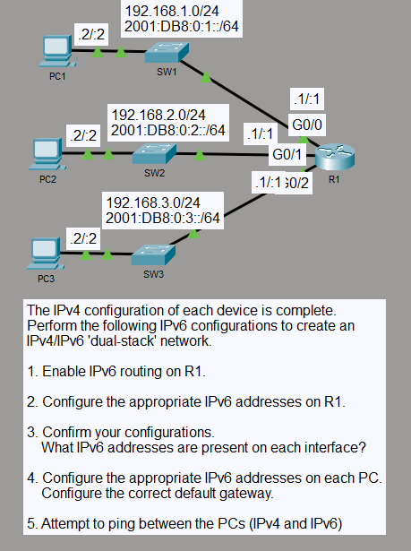

# IPv4/IPv6 Dual-Stack Routing

## Objective

I added IPv6 addressing to an existing IPv4 network to create a dual-stack environment across three LANs. I enabled IPv6 routing on R1 so the PCs could communicate between subnets using both IPv4 and IPv6.

## Topology

## Concepts

- IPv4/IPv6 dual-stack networking
- IPv6 global unicast and link-local addressing
- /64 IPv6 LAN prefixes
- IPv6 unicast routing
- IPv4 and IPv6 default gateways

## Configuration Highlights

- I configured R1 with `2001:DB8:0:1::1/64`, `2001:DB8:0:2::1/64`, and `2001:DB8:0:3::1/64` on its three LAN interfaces.
- I kept the existing IPv4 addressing in place and enabled `ipv6 unicast-routing` on R1.
- Each PC used the corresponding router interface as its IPv4 and IPv6 default gateway.

## Verification

I verified the IPv6 interface addresses and connected routes with `show ipv6 interface brief` and `show ipv6 route`.

I tested end-to-end connectivity from PC1 to PC2 and PC3 over both IPv4 and IPv6.

## Result

R1 routed all three IPv6 /64 networks while continuing to route the existing IPv4 subnets. PC1 reached both remote PCs over IPv4 and IPv6.
