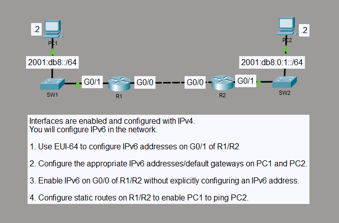

# IPv6 EUI-64 and Link-Local Static Routing

## Objective

I added IPv6 to an existing IPv4 two-router network. I used EUI-64 on the LAN-facing interfaces, enabled IPv6 on the inter-router link without assigning global IPv6 addresses, and configured static IPv6 routes so the two PCs could communicate between IPv6 subnets.

## Topology

## Concepts

- IPv6 EUI-64 interface addressing
- IPv6 global unicast and link-local addressing
- Link-local next hops
- IPv6 static routing
- IPv4/IPv6 dual-stack networking
- /64 IPv6 LAN prefixes

## Configuration Highlights

- I configured R1 G0/1 with `2001:DB8::/64 eui-64` and R2 G0/1 with `2001:DB8:0:1::/64 eui-64`.
- I enabled IPv6 on both G0/0 inter-router interfaces without assigning global unicast addresses, leaving the automatically generated link-local addresses for the transit link.
- I configured each remote /64 route using the neighboring router's G0/0 link-local address together with G0/0 as the exit interface.
- PC1 used `2001:DB8::2/64`, and PC2 used `2001:DB8:0:1::2/64`. Their IPv6 default gateways matched the EUI-64 addresses on R1 and R2.
- The existing IPv4 addressing and static routes remained in the final configuration.

## Verification

I verified the EUI-64 addresses, the link-local-only transit interfaces, and the static IPv6 routes with `show ipv6 interface brief`, `show ipv6 interface`, and `show ipv6 route`.

From PC1, I pinged `2001:DB8:0:1::2`. All four replies were received with 0% packet loss.

## Result

The two IPv6 /64 LANs communicated through static routes across an inter-router link that used only link-local IPv6 addresses. The IPv6 configuration was added alongside the existing IPv4 configuration.
