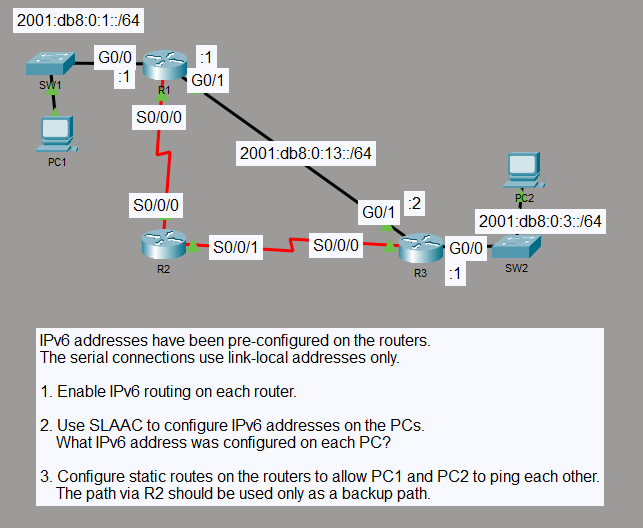

# IPv6 Floating Static Route Redundancy

## Objective

I built a three-router IPv6 topology with two LANs and a redundant path between the edge routers. I used SLAAC for the end hosts, direct static routes for the primary path, and floating static routes through R2 for backup connectivity.

## Topology

## Concepts

- IPv6 SLAAC
- IPv6 global unicast and link-local addressing
- IPv6 static routing
- Floating static routes
- Administrative distance
- Link-local next hops on serial links
- Route failover and redundancy

## Configuration Highlights

- R1 and R3 provide the `2001:DB8:0:1::/64` and `2001:DB8:0:3::/64` LANs, while their direct G0/1 link uses `2001:DB8:0:13::/64`.
- R1 and R3 use the direct G0/1 path as the primary route with the default static-route administrative distance of 1.
- I configured backup static routes with administrative distance 5 through R2 over the serial links.
- R2 uses link-local-only IPv6 addressing on both serial links and forwards traffic using neighboring link-local next-hop addresses.
- PC1 and PC2 obtained global IPv6 addresses and link-local default gateways through SLAAC.

## Verification

I verified the active routes with `show ipv6 route` and confirmed bidirectional PC1-to-PC2 connectivity with 0% packet loss while the direct R1-R3 path was available.

I then physically disconnected the direct R1-R3 link. R1 and R3 installed the floating static routes with administrative distance 5 through R2, and PC1-to-PC2 connectivity remained available with 0% packet loss. The ping TTL changed from 126 on the primary path to 125 on the backup path, reflecting the additional router hop through R2.

## Result

The direct R1-R3 route operates as the preferred path, while the serial path through R2 provides working IPv6 failover when the primary link is unavailable.
